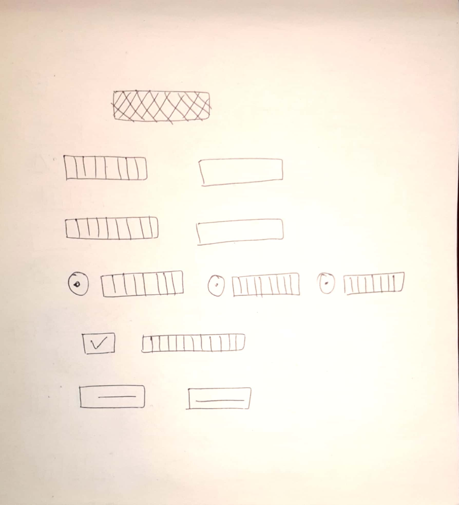
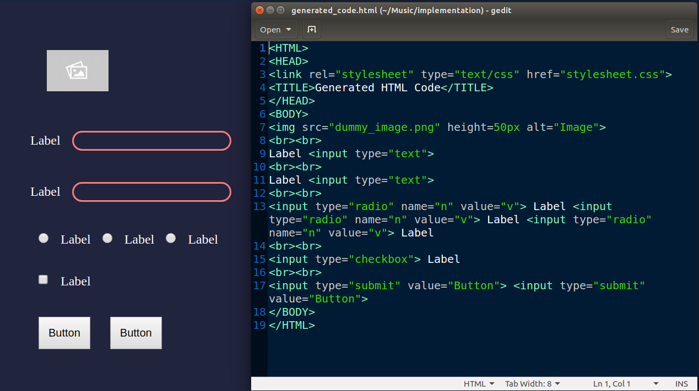

# ModernizationOfHTML

# Automatic HTML Code Generation from Images

This project takes a 'hand-drawn HTML page layout' image as an input from the user and converts it into a functional HTML webpage!

If you have a webpage design in mind but don't want to code the basic stuff? Well, now you don't have to. Just clone/download this repository, complete the setup and generate well-formatted HTML code for your website design in seconds.

**Input Image:**

**Output Page and Code:**

